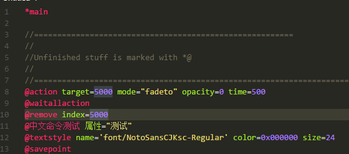
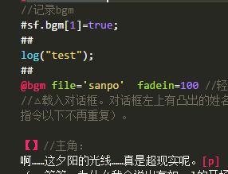

# VSCode-bkscr README

.bkscr is the extension name for [BKEngine](https://bke.bakery.moe/index_en.html) script files.

This extension gives the colorization of BKEngine script files.

We may add automatic completion and debugger in the future.

The effect is shown below:

